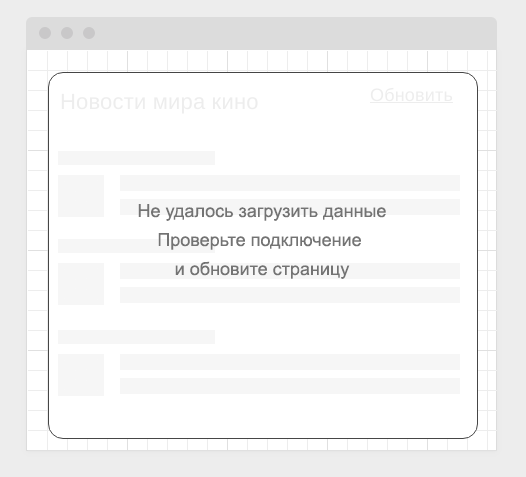

# WebWorkers, ServiceWorkers

[![Build status]](https://ci.appveyor.com/project/polinkavishinka/ahj_loading_styling) [[Github Pages](https://polinkavishinka.github.io/ahj_loading_styling)]

---

### Loading Styling

#### Легенда

Сейчас модно показывать интерфейсы загрузки вроде следующего:

#### Описание

Реализуйте подобный интерфейс, закешировав статические ресурсы и показывая данный внешний вид до момента загрузки данных.

Обратите внимание, даже если у пользователя нет подключения, страница всё равно должна отображаться, но в режиме "загрузки" и после неудачной попытки соединения переходить в режим:

Для эмуляции задержки можете самостоятельно написать middleware для koa, или посмотреть на существующие вроде [koa-slow](https://github.com/bahmutov/koa-slow)

Напоминаем, что для кэширования вы можете воспользоваться плагином Workbox.

---